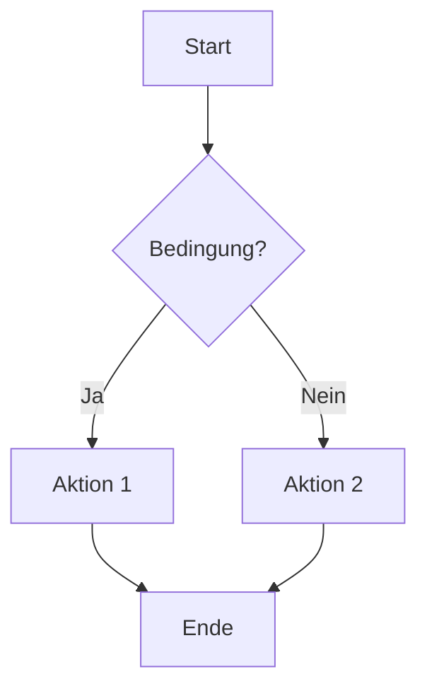

# Markdown Kurzreferenz

## Text

| Element | Syntax |
|---------|--------|
| Überschrift 1–6 | `#` bis `######` + Leerzeichen + Text |
| Fett | `**text**` oder `__text__` |
| Kursiv | `*text*` oder `_text_` |
| Fett+Kursiv | `***text***` |
| Durchgestrichen | `~~text~~` |
| Inline-Code | `` `code` `` |
| Hochgestellt | `<sup>text</sup>` |
| Tiefgestellt | `<sub>text</sub>` |
| Markiert | `<mark>text</mark>` |

## Struktur

| Element | Syntax |
|---------|--------|
| Absatz | Leerzeile zwischen Textblöcken |
| Zeilenumbruch | 2 Leerzeichen am Zeilenende oder `<br>` |
| Horizontale Linie | `---` oder `***` oder `___` (eigene Zeile) |
| Zitat | `> Text` (verschachtelt: `>>`) |
| Kommentar (unsichtbar) | `<!-- Kommentar -->` |

## Listen

| Element | Syntax |
|---------|--------|
| Ungeordnet | `- Item` oder `* Item` oder `+ Item` |
| Geordnet | `1. Item` (Nummer egal, wird auto-nummeriert) |
| Verschachtelt | 2 Leerzeichen Einrückung |
| Checkbox | `- [ ] Offen` / `- [x] Erledigt` |
| Definitionsliste | `Begriff` + Newline + `: Definition` |

## Tabellen

```
| Kopf 1 | Kopf 2 |
|--------|--------|
| Zelle  | Zelle  |
```

Ausrichtung: `|:---|` links, `|:---:|` zentriert, `|---:|` rechts

## Code

| Element | Syntax |
|---------|--------|
| Inline | `` `code` `` |
| Block | ```` ``` ```` oder 4 Leerzeichen Einrückung |
| Mit Syntax-Highlighting | ```` ```sprache ```` (z.B. `python`, `bash`, `js`) |

## Links & Medien

| Element | Syntax |
|---------|--------|
| Link | `[Text](URL)` |
| Link mit Titel | `[Text](URL "Titel")` |
| Referenz-Link | `[Text][id]` + `[id]: URL` |
| Autolink | `<https://url.de>` oder `<email@mail.de>` |
| Bild | `` |
| Bild mit Link | `[](URL)` |
| Bild mit Größe | `` |

## Erweitert (nicht überall unterstützt)

| Element       | Syntax                               |
| ------------- | ------------------------------------ |
| Fußnote       | `Text[^1]` + `[^1]: Fußnotentext`    |
| Abkürzung     | `*[HTML]: Hypertext Markup Language` |
| Anker/ID      | `## Überschrift {#custom-id}`        |
| Emoji         | `:emoji_name:` (z.B. `:smile:`)      |
| Mathe (LaTeX) | `$inline$` oder `$$block$$`          |
| Diagramme     | ```` ```mermaid ````                 |

## Escaping

Sonderzeichen mit `\` maskieren: `\*`, `\#`, `\|`, `\[`, `` \` ``  
Dead Key: `` ` `` + Leertaste → einzelnes Backtick (Dasselbe mit `` ´ ``)


## Unicode-Referenz für Markdown

**Eingabemethoden**

| **Umgebung**                            | **Methode**                   |
| --------------------------------------- | ----------------------------- |
| Windows                                 | `Win + .` oder `Alt + Numpad` |
| GNOME/VSCodium/(wenn ibus-daemon aktiv) | `Ctrl+Shift+U` + Hex + Enter  |
| NVIM                                    | Insert: `Ctrl+V u` + Hex      |
| Obsidian Android                        | Unicode Pad App → kopieren    |

**Zeichen + Codes**

```
BOXEN
─ 2500   │ 2502   ┌ 250C   ┐ 2510   └ 2514   ┘ 2518
├ 251C   ┤ 2524   ┬ 252C   ┴ 2534   ┼ 253C
═ 2550   ║ 2551   ╔ 2554   ╗ 2557   ╚ 255A   ╝ 255D
╭ 256D   ╮ 256E   ╰ 256F   ╯ 2570

PFEILE
→ 2192   ← 2190   ↑ 2191   ↓ 2193   ↔ 2194
⇒ 21D2   ⇐ 21D0   ⇔ 21D4

LISTEN/CHECKBOXEN
- 2022   ◦ 25E6   ■ 25A0   □ 25A1
☐ 2610   ☑ 2611   ☒ 2612   ✓ 2713   ✗ 2717

MATHEMATIK
≈ 2248   ≠ 2260   ≤ 2264   ≥ 2265
± 00B1   × 00D7   ÷ 00F7   ∞ 221E

TYPOGRAFIE
— 2014   – 2013   … 2026
« 00AB   » 00BB   „ 201E   " 201C

UMLAUTE
ä 00E4   ö 00F6   ü 00FC   ß 00DF
Ä 00C4   Ö 00D6   Ü 00DC
```

## Erweiterte Funktionen (nicht überall unterstützt!)

### Callouts (Hervorgehobene Hinweise)

```

Syntax:
> [!TYPE]
> Inhalt hier

> Hinweis

> [!NOTE]
> Allgemeiner Hinweis

> [!NOTE] Eigener Titel
> Allgemeiner Hinweis

> [!NOTE]- Klick zum Öffnen
> Versteckter Inhalt

> [!TIP]
> Hilfreicher Tipp

> [!WARNING]
> Warnung

> [!CAUTION]
> Vorsicht, gefährlich

> [!IMPORTANT]
> Wichtige Info
```

### YAML Frontmatter
**Syntax: Muss ganz oben in der Datei stehen, zwischen ---**
```
---
title: Dokumenttitel
author: Dein Name
date: 2025-01-20
tags:
  - markdown
  - guide
status: draft
---
```


### Matheformeln (LaTeX-Syntax)


```
Inline: $E = mc^2$

Block:
$$
\int_0^\infty e^{-x^2} dx = \frac{\sqrt{\pi}}{2}
$$
```

### Diagramme (Mermaid)

````

````


**Mermaid-Diagrammtypen:** `graph`, `sequenceDiagram`, `classDiagram`, `stateDiagram`, `erDiagram`, `gantt`, `pie`, `gitGraph`

### Lua-Scripting (Pandoc)

**Rendering:** Nur Pandoc (Kommandozeilen-Konverter)

Filter-Datei `uppercase.lua`:
```lua
function Str(elem)
    return pandoc.Str(string.upper(elem.text))
end
```

Anwendung:
```bash
pandoc input.md --lua-filter=uppercase.lua -o output.pdf
```

**Pandoc-Fähigkeiten:** Format-Konvertierung (MD → PDF/DOCX/HTML/EPUB), Variablen, Templates, Zitationen (BibTeX), Custom Writer
